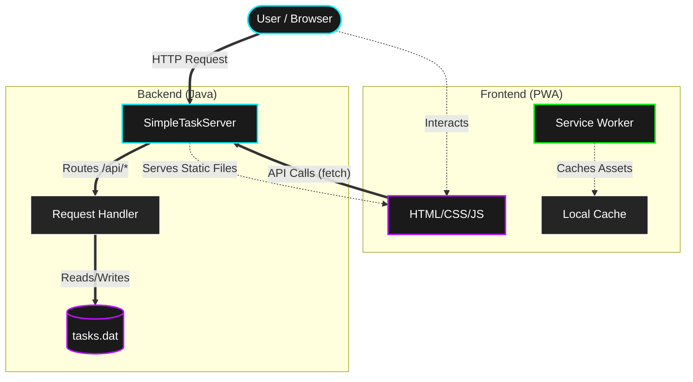
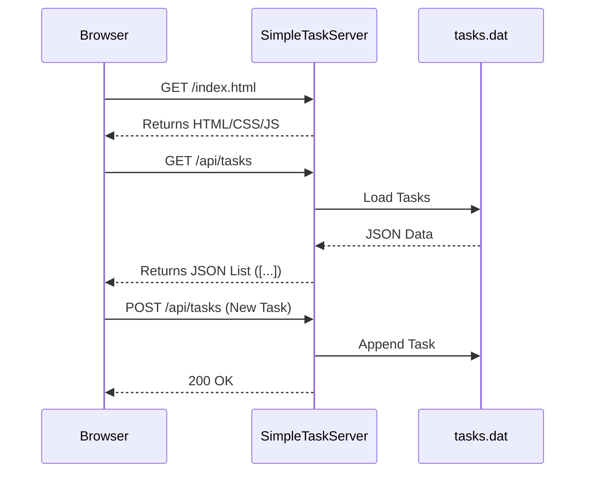

# Task Flow

> **Elevate your productivity.**
> A premium, modern To-Do application built with a custom Java HTTP server and a Progressive Web App (PWA) frontend.


## 🌟 Features

- **Premium UI/UX**: Glassmorphism design, neon glow effects, and smooth animations.
- **Progressive Web App**: Installable on devices, offline-capable (Service Worker caching).
- **Custom Backend**: Lightweight Java HTTP server (No external frameworks like Spring/Tomcat needed).
- **Task Management**: Create, Edit, Delete, and Toggle status of tasks.
- **Smart Filtering**: Filter by All, Ongoing, and Completed tasks.
- **Responsive**: Fully optimized for Desktop and Mobile.

## 🎨 Visual Representation

### System Architecture



### Request Flow



## 🛠️ Tech Stack

- **Backend**: Java (JDK 8+), `com.sun.net.httpserver`
- **Frontend**: HTML5, CSS3 (Variables, Flexbox, Animations), JavaScript (ES6+)
- **Storage**: Local binary file storage (`tasks.dat`)

## 🚀 Getting Started

### Prerequisites

- Java Development Kit (JDK 8 or higher)
- Git

### Installation

1.  **Clone the repository**

    ```bash
    git clone https://github.com/10Niranjan/ToDo_List-.git
    cd ToDo_List-
    ```

2.  **Compile the Server**

    ```bash
    javac -sourcepath src -d out src/SimpleTaskServer.java
    ```

3.  **Run the Application**

    ```bash
    java -cp out SimpleTaskServer
    ```

4.  **Open in Browser**
    Visit [http://localhost:8000](http://localhost:8080)

## 🤝 Contributing

Contributions are welcome! Please fork the repository and open a pull request.

## 📄 License

This project is open-source and available under the [MIT License](LICENSE).
